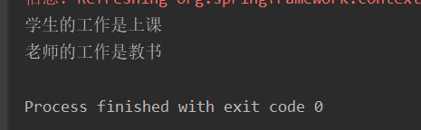
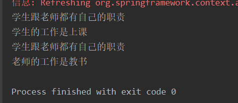

# 一 AOP—面向切面编程

## 1.1 什么是AOP

AOP （Aspect Orient Programming），直译为面向切面编程。与IOC一样，也是一种编程思想，是面向对象编程（OOP）的一种补充。


## 1.2 使用场景

- **事务处理**
- **日志管理**
- **权限控制**

# 二 Spring AOP简单例子

1. 首先导入Spring依赖

   ```xml
   <!-- Spring 5.0 context管理工具包 -->
           <dependency>
               <groupId>org.springframework</groupId>
               <artifactId>spring-context</artifactId>
               <version>5.0.7.RELEASE</version>
           </dependency>
   ```

   

2. 创建一个接口 IWork.java：

   ```java
   public interface IWork {
       String work();
   }
   ```

   

3. 创建两个类实现这个接口 

   Student.java

   ```java
   //Component表明该类作为一个Bean被注入工厂
   @Component
   public class Student implements IWork{
       private String sName;
       private int age;
       private Teacher teacher;
   
       public Student() {
           this.sName = "小王";
           this.age = 21;
       }
   
       public String work() {
           System.out.println("学生的工作是上课");
           return "上课";
       }
   }
   
   ```

   Teacher.java

   ```java
   @Component
   public class Teacher implements IWork{
       private String tName;
   
       public String work() {
           System.out.println("老师的工作是教书");
           return "教书";
       }
   }
   ```

   

4. 设置配置文件（也可以直接设置在启动类）

   ```java
   //标志为配置文件，相当于xml
   @Configuration
   //将指定路径的类注入容器
   @ComponentScan(basePackageClasses = {entity.IWork.class})
   //启用AOP功能
   @EnableAspectJAutoProxy(proxyTargetClass = true)
   public class AppConfig {
   
   }
   ```

   

5. 设置启动类

   ```java
   public class SpringAOPApplication {
       public static void main(String[] args) {
           Student student1 = new Student();
           System.out.println(student1);
   
           //通过注解配置工厂
           AnnotationConfigApplicationContext factory = new AnnotationConfigApplicationContext(AppConfig.class);
           Student student = (Student) factory.getBean("student");
           student.work();
           Teacher teacher = (Teacher) factory.getBean("teacher");
           teacher.work();
       }
   }
   ```

   

6. 输出运行

   

   这里用的是Spring的自动装配，关于IOC容器以及依赖注入详细解释可以看这篇：[深入理解控制反转IOC和依赖注入](https://blog.csdn.net/weixin_46047193/article/details/126684056)

   接下来如果想要在work()方法之前，打印出“学生跟老师都有自己的职责”，就需要Spring AOP。本次是使用注解的形式进行Bean注入配置工厂，若通过xml文件进行AOP配置可以查阅此篇：[Spring AOP－xml配置](https://www.cnblogs.com/danqiu/p/6179109.html)

1. pom.xml文件中导入相关AOP依赖

   ```xml
   <dependency>
               <groupId>org.springframework</groupId>
               <artifactId>spring-aspects</artifactId>
               <version>5.0.7.RELEASE</version>
           </dependency>
   ```

   

2. 设置一个切面类 WorkAspectJ.java

   ```java
   //表示是一个切面
   @Aspect
   //表明该类作为一个Bean被装配
   @Component
   public class WorkAspectJ {
       //@Before表示将在方法执行前执行，参数"execution(* entity.IWork.work(..))"声明切点位置。
       @Before("execution(* entity.IWork.work(..))")
       public void test() {
           System.out.println("学生跟老师都有自己的职责");
       }
   }
   ```

     使用了注解 `@Component` 表明它将作为一个Spring Bean 被装配，使用注解 `@Aspect` 表示它是一个切面。
     类中只有一个方法 `test` 我们使用 `@Before` 这个注解，表示他将在方法执行之前执行。

     参数`("execution(* entity.IWork.work(..))")` 声明了切点，表明在该切面的切点是`entity.IWork`这个接口中的`work`方法

3. 在配置文件中设置开启AOP切面功能

   ```java
   //标志为配置文件，相当于xml
   @Configuration
   //将指定路径的类注入容器
   @ComponentScan(basePackageClasses = {entity.IWork.class})
   //启用AOP功能
   @EnableAspectJAutoProxy(proxyTargetClass = true)
   public class AppConfig {
   
   }
   ```

   增加了`@EnableAspectJAutoProxy`注解，启用了 AOP 功能，参数`proxyTargetClass`的值设为了 true 。默认值是 false

4. 测试运行

   

   这样无需对`Student`和`Teacher`进行修改，也不用修改启动类，同样实现了需求，这就是Spring AOP切面功能。

